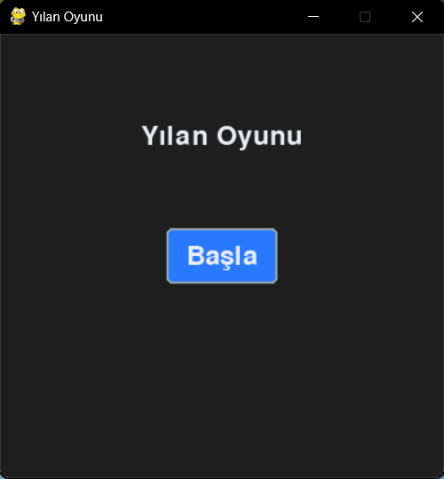
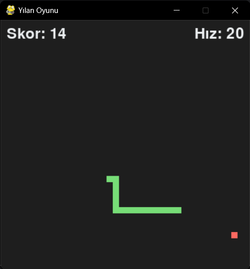
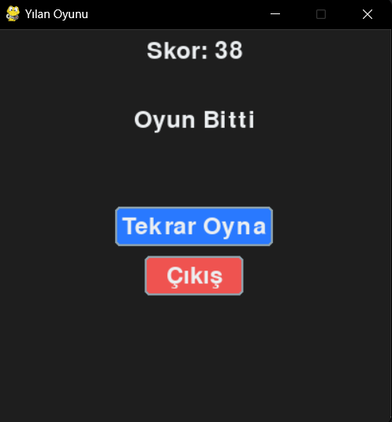

# Yılan Oyunu (Pygame)

Bu proje, **Pygame** kullanılarak geliştirilmiş klasik bir yılan oyunudur. Oyunda yılanı kontrol ederek yemleri toplamanız ve mümkün olduğunca uzun süre hayatta kalmanız gerekiyor.

## Özellikler

- Modern ve pastel renklerle tasarlanmış bir oyun arayüzü.
- Başlangıç menüsü ve oyun bitiş ekranı.
- Skor sistemi.
- Dinamik yem oluşturma.
- Yılanın duvarlardan geçiş yapabilmesi.
- Yılanın hızlanma mekaniği: Yılan her 5 yem yediğinde hızı artar.

## Ekran Görüntüleri

### Ana Menü



### Oyun Ekranı



### Oyun Bitiş Ekranı



## Kurulum

1. Bu projeyi bilgisayarınıza klonlayın:
   ```bash
   git clone https://github.com/kullaniciadi/Yilan_Oyunu_Pygame.git
   cd Yilan_Oyunu_Pygame
   ```

2. Gerekli bağımlılıkları yüklemek için aşağıdaki komutu çalıştırın:
   ```bash
   pip install -r requirements.txt
   ```

3. Oyunu başlatmak için aşağıdaki komutu çalıştırın:
   ```bash
   python main.py
   ```

## Kullanım

- **Yön Tuşları**: Yılanı hareket ettirmek için kullanılır.
- **Başla Butonu**: Oyunu başlatır.
- **Tekrar Oyna Butonu**: Oyun bittikten sonra yeniden başlatır.
- **Çıkış Butonu**: Oyundan çıkar.

## Proje Yapısı

```
Yilan_Oyunu_Pygame/
│   
├── main.py              # Oyunu başlatan dosya
│
├── core/                # Oyun mantığı ve işlevleri
│   ├── game.py          # Ana oyun dosyası
│   ├── settings.py      # Oyun ayarları ve renkler
│   ├── snake.py         # Yılan ile ilgili işlevler
│   ├── food.py          # Yem ile ilgili işlevler
│   └── ui.py            # Kullanıcı arayüzü işlevleri
│
├── resources/           # Ekran görüntüleri ve diğer görseller
│
├── README.md            # Proje açıklaması
├── requirements.txt     # Gerekli bağımlılıkların listesi
└── LICENSE              # Lisans dosyası
```

## Katkıda Bulunma

Katkıda bulunmak isterseniz lütfen bir **pull request** gönderin veya bir **issue** açın.

## Lisans

Bu proje [MIT Lisansı](LICENSE) ile lisanslanmıştır.
